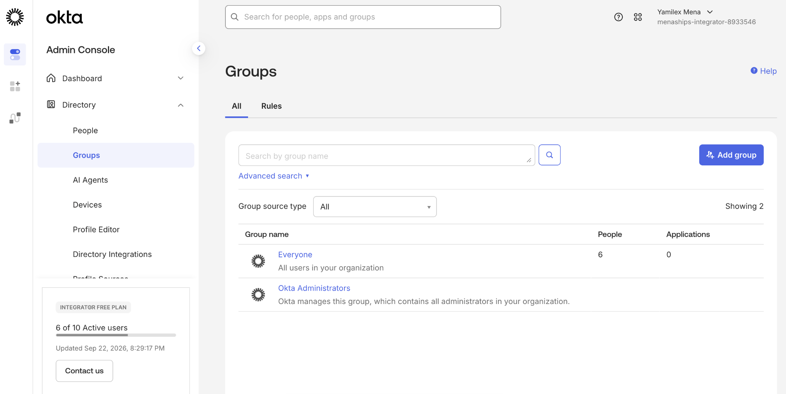
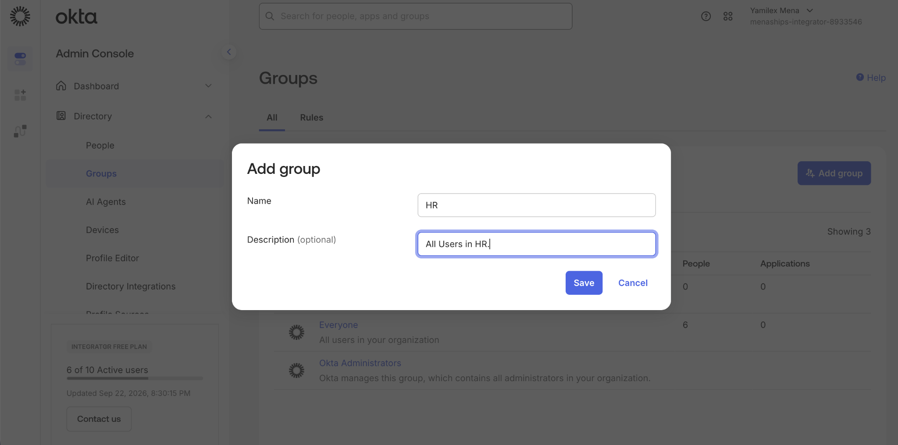
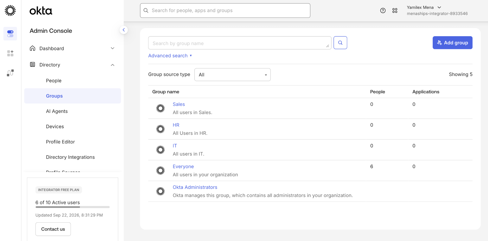

# Creating Groups in Okta Environment

## Objective

Create groups in Okta to organize users and support more efficient identity and access management.

## Step 1: Review Existing Groups

Reviewed the existing Okta groups before creating new groups for different departments.

## Step 2: Create a New Group

Created an **HR** group and added a description to identify its purpose.

## Step 3: Verify Created Groups

Confirmed that the **Sales**, **HR**, and **IT** groups were successfully created in the Okta environment.

## Skills Demonstrated

- Okta Administration
- Group Management
- Identity and Access Management
- User Organization
- Access Management Foundations
